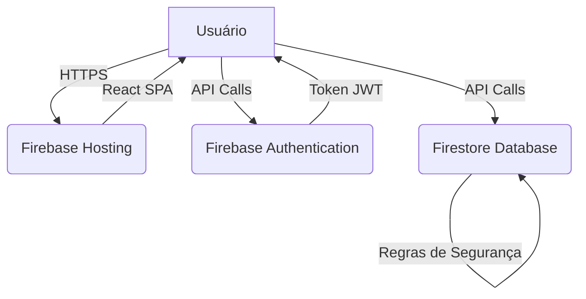

# 🛠️ Documentação Técnica - Younv Clinical Scripts

Este documento fornece uma visão técnica aprofundada do sistema Younv Clinical Scripts, incluindo arquitetura, estrutura de dados, APIs e configurações avançadas.

---

## 🏗️ Arquitetura do Sistema

### **1. Visão Geral**

O Younv Clinical Scripts é uma **Single-Page Application (SPA)** construída com **React** e hospedada no **Firebase Hosting**. O backend é servido pelo **Firebase**, utilizando **Firestore** como banco de dados e **Firebase Authentication** para controle de acesso.

### **2. Componentes Principais**

#### **Frontend (React)**
- **Framework**: React 18.2.0
- **Roteamento**: React Router 6.14.2
- **Estilização**: Tailwind CSS 3.3.3
- **Ícones**: Lucide React 0.263.1
- **Formulários**: React Hook Form 7.45.4
- **Build Tool**: Vite 4.4.5

#### **Backend (Firebase)**
- **Banco de Dados**: Firestore (NoSQL)
- **Autenticação**: Firebase Authentication
- **Hospedagem**: Firebase Hosting
- **SDK**: Firebase 9.23.0

#### **Infraestrutura**
- **Controle de Versão**: Git
- **Hospedagem de Código**: GitHub
- **CI/CD**: GitHub Actions (opcional)
- **Gerenciador de Pacotes**: pnpm 8.6.12

### **3. Fluxo de Dados**

1. **Requisição do Usuário**: O navegador solicita a página inicial do Firebase Hosting.
2. **Carregamento da SPA**: O React é carregado e o roteador assume o controle.
3. **Autenticação**: O usuário faz login via Firebase Authentication.
4. **Acesso ao Firestore**: O frontend faz chamadas diretas ao Firestore para buscar e modificar dados.
5. **Regras de Segurança**: O Firestore aplica regras de segurança para garantir que o usuário tenha permissão para acessar os dados.

### **4. Diagrama de Arquitetura**



---

## 🗃️ Estrutura de Dados (Firestore)

### **1. Coleções Principais**

#### **`clinics`**
- **Descrição**: Armazena informações sobre cada clínica cadastrada.
- **Documento ID**: `clinicId` (gerado automaticamente)

```json
{
  "name": "Clínica São Lucas",
  "address": "Rua das Flores, 123",
  "phone": "(11) 5555-1234",
  "website": "https://clinicasaolucas.com.br",
  "createdAt": "2024-07-27T10:00:00Z",
  "updatedAt": "2024-07-27T10:00:00Z"
}
```

#### **`users`**
- **Descrição**: Armazena informações sobre cada usuário.
- **Documento ID**: `userId` (mesmo que o UID do Firebase Auth)

```json
{
  "name": "Dr. João Silva",
  "email": "joao.silva@clinicasaolucas.com.br",
  "clinicId": "clinic_123",
  "role": "admin", // "super_admin", "admin", "user"
  "createdAt": "2024-07-27T10:00:00Z",
  "lastLogin": "2024-07-27T14:30:00Z"
}
```

#### **`scripts`**
- **Descrição**: Armazena todos os scripts do sistema.
- **Documento ID**: `scriptId` (gerado automaticamente)

```json
{
  "title": "Primeiro Contato - Telefone",
  "content": "Olá! Aqui é [NOME] da [CLÍNICA]. Como posso ajudar?",
  "categoryId": "atendimento",
  "clinicId": "clinic_123",
  "tags": ["telefone", "recepção"],
  "steps": [
    {"order": 1, "description": "Cumprimentar cordialmente"},
    {"order": 2, "description": "Identificar-se"}
  ],
  "usageCount": 150,
  "lastUsedAt": "2024-07-27T14:00:00Z",
  "createdAt": "2024-07-20T10:00:00Z",
  "createdBy": "user_abc",
  "status": "active" // "active", "inactive"
}
```

#### **`categories`**
- **Descrição**: Armazena as categorias de scripts.
- **Documento ID**: `categoryId` (ex: "atendimento")

```json
{
  "name": "Atendimento",
  "description": "Scripts para recepção e primeiro contato",
  "icon": "Phone",
  "order": 1
}
```

#### **`activity`**
- **Descrição**: Log de atividades importantes no sistema.
- **Documento ID**: `activityId` (gerado automaticamente)

```json
{
  "type": "script_created", // "user_login", "script_used", etc.
  "userId": "user_abc",
  "clinicId": "clinic_123",
  "details": {
    "scriptId": "script_xyz",
    "scriptTitle": "Orientações Pré-Cirurgia"
  },
  "timestamp": "2024-07-27T14:30:00Z"
}
```

### **2. Índices do Firestore**

Para otimizar as consultas, os seguintes índices são recomendados:

- **`scripts`**: `clinicId` (asc), `categoryId` (asc), `lastUsedAt` (desc)
- **`scripts`**: `clinicId` (asc), `usageCount` (desc)
- **`activity`**: `clinicId` (asc), `timestamp` (desc)

---

## ⚙️ APIs e Serviços

### **1. `firebase.js`**

- **Localização**: `src/lib/firebase.js`
- **Descrição**: Inicializa e exporta os serviços do Firebase.

```javascript
import { initializeApp } from "firebase/app";
import { getAuth } from "firebase/auth";
import { getFirestore } from "firebase/firestore";

const firebaseConfig = {
  apiKey: import.meta.env.VITE_FIREBASE_API_KEY,
  // ... outras chaves
};

const app = initializeApp(firebaseConfig);
export const auth = getAuth(app);
export const db = getFirestore(app);
```

### **2. `authService.js`**

- **Localização**: `src/services/authService.js`
- **Descrição**: Funções relacionadas à autenticação.

- **`login(email, password)`**: Autentica o usuário.
- **`logout()`**: Desloga o usuário.
- **`onAuthStateChanged(callback)`**: Observa mudanças no estado de autenticação.
- **`getCurrentUser()`**: Retorna o usuário atual.

### **3. `clinicService.js`**

- **Localização**: `src/services/clinicService.js`
- **Descrição**: Funções para gerenciar clínicas.

- **`getClinics()`**: Retorna todas as clínicas.
- **`getClinic(clinicId)`**: Retorna uma clínica específica.
- **`createClinic(data)`**: Cria uma nova clínica.
- **`updateClinic(clinicId, data)`**: Atualiza uma clínica.

### **4. `scriptService.js`**

- **Localização**: `src/services/scriptService.js`
- **Descrição**: Funções para gerenciar scripts.

- **`getScripts(clinicId, categoryId)`**: Retorna scripts filtrados.
- **`searchScripts(clinicId, query)`**: Busca scripts.
- **`getScript(scriptId)`**: Retorna um script específico.
- **`createScript(data)`**: Cria um novo script.
- **`updateScript(scriptId, data)`**: Atualiza um script.
- **`deleteScript(scriptId)`**: Exclui um script.

---

## ⚛️ Estrutura do Frontend (React)

### **1. `src/components`**

- **`forms/`**: Componentes de formulário (ex: `LoginForm.jsx`).
- **`layout/`**: Componentes de layout (ex: `Sidebar.jsx`, `MainLayout.jsx`).
- **`ui/`**: Componentes de UI genéricos (ex: `Button.jsx`, `Modal.jsx`).

### **2. `src/contexts`**

- **`AuthContext.jsx`**: Gerencia o estado de autenticação e informações do usuário.

### **3. `src/hooks`**

- **`useAuth.js`**: Hook para acessar o `AuthContext`.
- **`useScripts.js`**: Hook para buscar e gerenciar scripts.
- **`useClinics.js`**: Hook para buscar e gerenciar clínicas.

### **4. `src/pages`**

- **`LoginPage.jsx`**: Página de login.
- **`DashboardPage.jsx`**: Dashboard principal.
- **`SearchPage.jsx`**: Página de busca.
- **`CategoryScriptsPage.jsx`**: Página de scripts por categoria.
- **`admin/`**: Páginas do painel administrativo.

### **5. `src/App.jsx`**

- **Descrição**: Componente raiz que configura o roteamento.

```jsx
import { BrowserRouter as Router, Routes, Route } from 'react-router-dom';
import { AuthProvider } from './contexts/AuthContext';
import ProtectedRoute from './components/layout/ProtectedRoute';

function App() {
  return (
    <AuthProvider>
      <Router>
        <Routes>
          <Route path="/login" element={<LoginPage />} />
          <Route path="/dashboard" element={<ProtectedRoute><DashboardPage /></ProtectedRoute>} />
          {/* ... outras rotas */}
        </Routes>
      </Router>
    </AuthProvider>
  );
}
```

---

## 🔐 Segurança

### **1. Regras do Firestore**

As regras de segurança são a principal camada de proteção do backend.

```javascript
rules_version = '2';
service cloud.firestore {
  match /databases/{database}/documents {
    match /users/{userId} {
      allow read, write: if request.auth.uid == userId;
    }
    match /scripts/{scriptId} {
      allow read: if request.auth != null;
      allow write: if get(/databases/$(database)/documents/users/$(request.auth.uid)).data.role == 'admin';
    }
  }
}
```

### **2. Autenticação**

- **Tokens JWT**: O Firebase Auth usa tokens JWT para autenticar requisições.
- **Custom Claims**: Roles e permissões podem ser adicionados como custom claims no token.

### **3. Frontend**

- **Validação de Formulários**: Usa `react-hook-form` para validação no lado do cliente.
- **Proteção de Rotas**: O componente `ProtectedRoute` impede acesso a páginas restritas.

---

## 🚀 Build e Deploy

### **1. Comandos de Build**

- **`pnpm dev`**: Inicia o servidor de desenvolvimento.
- **`pnpm build`**: Gera os arquivos de produção no diretório `dist/`.
- **`pnpm preview`**: Testa o build de produção localmente.

### **2. Configuração do Vite (`vite.config.js`)**

```javascript
import { defineConfig } from 'vite';
import react from '@vitejs/plugin-react';

export default defineConfig({
  plugins: [react()],
  server: {
    port: 3000,
    open: true
  }
});
```

### **3. Deploy no Firebase Hosting**

#### **`firebase.json`**

```json
{
  "hosting": {
    "public": "dist",
    "ignore": [
      "firebase.json",
      "**/.*",
      "**/node_modules/**"
    ],
    "rewrites": [
      {
        "source": "**",
        "destination": "/index.html"
      }
    ]
  }
}
```

#### **Comandos de Deploy**

```bash
# Login no Firebase (apenas uma vez)
firebase login

# Deploy
firebase deploy --only hosting
```

---

## 🔧 Configurações Avançadas

### **1. Variáveis de Ambiente**

- **`.env.local`**: Para desenvolvimento local.
- **`.env.production`**: Para builds de produção.

### **2. Customização de Tema (Tailwind)**

- **Arquivo**: `tailwind.config.js`

```javascript
module.exports = {
  theme: {
    extend: {
      colors: {
        primary: '#007bff',
        secondary: '#6c757d',
      },
    },
  },
};
```

### **3. Scripts NPM**

- **`dev`**: Inicia servidor de desenvolvimento.
- **`build`**: Gera build de produção.
- **`lint`**: Executa ESLint.
- **`preview`**: Testa build de produção.
- **`seed`**: Popula o banco de dados com dados de exemplo.

---

## 📊 Monitoramento e Logs

### **1. Firebase**

- **Performance Monitoring**: Ative no console para monitorar performance.
- **Crashlytics**: Ative para relatórios de erros.
- **Analytics**: Integre para análise de uso.

### **2. Frontend**

- **React DevTools**: Ferramenta para depuração de componentes.
- **Sentry/LogRocket**: Ferramentas de terceiros para monitoramento de erros.

---

## 🎯 Roadmap Técnico

### **Curto Prazo**
- [ ] Implementar testes unitários com Vitest.
- [ ] Adicionar testes de integração com Cypress.
- [ ] Configurar CI/CD com GitHub Actions.
- [ ] Otimizar consultas ao Firestore com paginação.

### **Médio Prazo**
- [ ] Migrar para TypeScript.
- [ ] Implementar lazy loading de rotas.
- [ ] Adicionar suporte a modo escuro.
- [ ] Criar storybook para componentes UI.

### **Longo Prazo**
- [ ] Desenvolver app mobile com React Native.
- [ ] Explorar uso de Cloud Functions para lógica de backend.
- [ ] Implementar busca full-text com Algolia.

---

*Esta documentação técnica fornece uma base sólida para o desenvolvimento e manutenção do Younv Clinical Scripts. Para mais detalhes, consulte o código fonte e a documentação oficial das tecnologias utilizadas.*

